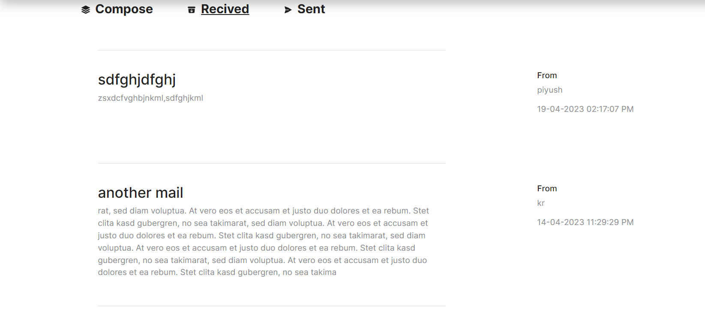

# mailWebsite
This is an ASP.NET project which can be used to send text/mail to any other user on the website using their username and can receive text/mail for any user on the website.
### front page

### registration page

### login page

### compose page

### recived page

